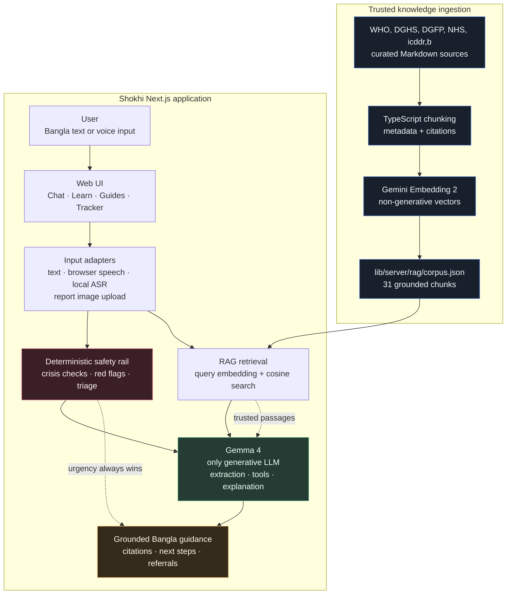

<p align="center">
  
</p>

<div align="center">
  <h1>🌸 সখী · Shokhi</h1>
  <p><strong>A Bangla-first AI health and wellbeing companion for girls, women, and families in Bangladesh.</strong></p>
  <p>Private, simple guidance for periods, PCOS, pregnancy, postpartum health, and menopause — powered by Gemma 4.</p>
  <p>🌐 <a href="#demo">Demo</a> · 📖 <a href="docs/KAGGLE_WRITEUP.md">Kaggle writeup</a> · 🛡️ <a href="#safety-first-design">Safety-first design</a></p>
</div>

Shokhi (সখী — *"a trusted confidante"*) lets girls and women **type or speak in Bangla**,
then combines Gemma 4's language understanding with a deterministic safety layer to explain
what may be happening, what to do next, and when to contact a real health professional.

> Shokhi is a **health companion, not a doctor**. It gives an initial sense and safe
> guidance; a qualified doctor confirms any diagnosis. Emergencies → **999**.

## 🔒 Privacy

> No account required. Your profile and tracker data stay on your device. Chat messages are
> processed by Shokhi and Gemma 4 when hosted mode is enabled; browser voice input is handled
> by the device, and optional RAG embeddings are non-generative. Please do not share your name,
> phone number, address, or identifying details.

Gemma 4 is Shokhi's only generative health model. Shokhi does not currently use an account system or a
database for user profiles, tracker logs, or chat history; hosting and AI providers may
still process request data according to their own retention and logging policies.

The Profile page includes **Delete everything on this device**, which removes Shokhi's
browser-only data (profile, tracker, mood, report history, reminders, theme, and language
preferences) from the current browser. It does not touch data belonging to other sites.

## 🎬 Demo

The app runs as a single Next.js project with no login required. Add the hosted URL and
short demo-video URL here before the Kaggle submission:

**🌐 Live demo:** _add public URL_ · **▶️ Demo video:** _add public video URL_

---

## 🧭 Shokhi's focus

Shokhi is designed as a warm, Bangla-first health and wellbeing companion for menstrual
health, PCOS, pregnancy, postpartum care, menopause, adolescent wellbeing, nutrition,
protection, WASH, climate preparedness, education, and disability inclusion. It combines
voice input, low-literacy guidance, trusted-source cards, and a deterministic safety layer
beneath the AI responses.

### UNICEF Bangladesh-aligned learning

The Learn and Guides areas now include cards covering adolescent wellbeing, child protection,
nutrition and anaemia, safe water and hygiene, climate and disaster safety, education and
digital skills, disability inclusion, mental wellbeing, and safe referrals. These cards remain
inside the existing Learn/Guides experience so the navigation stays small and situation-first.
They are educational summaries, not UNICEF-endorsed medical advice.

---

## 🧠 How Gemma 4 is integrated (and why it's core)

Shokhi is built on a **"one Gemma brain, a safety rail underneath"** architecture:

```
  Bangla text / voice
          │
          ▼
  ┌───────────────────┐   free-form language → structured symptoms
  │   Gemma 4         │   (extract_symptoms)
  │   (NLP + empathy) │
  └───────────────────┘
          │  symptom profile (JSON)
          ▼
  ┌───────────────────┐   DETERMINISTIC — never the LLM
  │  Triage engine    │   urgency + red flags + suspected conditions
  │  (triage.ts)      │   (emergency / see-doctor / self-care / info)
  └───────────────────┘
          │  safety-checked result (JSON)
          ▼
  ┌───────────────────┐   result → warm, literacy-appropriate Bangla
  │   Gemma 4         │   (explain_triage, bust_myth)
  │   (generation)    │
  └───────────────────┘
          │
          ▼
  Bangla guidance (text)
```

## 🏗️ System architecture

The diagram below shows the complete path from trusted health sources and user input to a
grounded, safety-checked Gemma 4 response. The embedding model only performs numerical
retrieval; it never generates the answer.



### What the Gemma 4 upgrade adds

- **Structured intake:** hosted Gemma 4 uses a constrained `record_symptoms` function call.
  Shokhi keeps only allowed fields, records evidence snippets and confidence, and marks
  uncertainty instead of turning guesses into symptoms. The deterministic extractor remains
  available with `SHOKHI_LLM_EXTRACT=0`.
- **Adaptive reasoning:** routine turns use minimal thinking for speed; ambiguous or urgent turns
  use high thinking. The model never controls the urgency decision.
- **Safe tools:** Gemma may request only the allow-listed Bangladesh support-number tool. It has
  no external side effects, is bounded to two rounds, and cannot change triage urgency.
- **Structured vision:** report photos use a constrained review tool for image quality, key
  findings, visible values, uncertainty, and safe next steps. A deterministic haemoglobin check
  runs independently on the rendered review.
- **Privacy mode:** the same backend interface supports hosted Gemma 4, local Gemma 4, and a
  deterministic mock, so a clinic or kiosk can keep local-mode text on the device.

**Gemma 4 does the hard, generative work** — understanding messy real-world Bangla, and
speaking back with warmth at the right literacy level. The **triage decision is made by
rules, not the model**, so Gemma can **never under-triage an emergency** because of a
hallucination. This is the standard safe pattern for health AI: *LLM for language,
deterministic logic for safety-critical decisions.*

### 🎙️ Voice input — fast, private, and device-aware

A woman can **speak** her symptoms instead of typing. In the chat, the microphone now uses a
Voice Bridge: audio is transcribed, passed through structured Gemma extraction, and sent through
the same deterministic triage pipeline as typed input. The recognized words and guidance appear
together, so the user does not need to type after speaking. Browsers without recording support
can fall back to device-native speech recognition.

Report photos are sent directly to multimodal Gemma 4, which reads the visible test names,
values, units and reference ranges and explains them in simple language. Unclear values are
marked as uncertain rather than guessed; the result is general information, not a diagnosis.

The report experience now uses Gemma as a structured companion rather than a single paragraph:

- **Structured report advice** — Gemma returns a simple summary, value-by-value review, next
  steps, and questions to ask a doctor; the UI renders these as readable cards.
- **Local report history** — the browser keeps up to 12 report summaries and compares repeated
  values such as haemoglobin or TSH on the device; uploaded image bytes are not stored.
- **Doctor handoff** — a local, copyable/downloadable visit summary collects the report source,
  visible values, and safety reminder without claiming a diagnosis.
- **Family explanation modes** — the same Gemma family note can be addressed to family,
  partner, or mother/older family members.
- **Weekly personal companion** — cycle phase, mood logs, conditions, and the next seven days
  become a gentle Gemma-written weekly plan.
- **Specialist image review** — an optional stricter multimodal review checks image quality,
  visible findings, printed reference ranges, uncertainty, and safe next steps.

The specialist review is a prompting/review mode on the current multimodal Gemma backend; it
does not present itself as a diagnosis or replace a clinician.

Other supporting (non-generative, allowed) tools: the RAG corpus + embeddings, a knowledge
base of red flags / conditions / myths, and the two logistic-regression risk classifiers.

## 🧠 Multi-Provider AI Fallback (reliability by design)

Shokhi keeps the Gemma 4 experience available across hosted and offline provider paths. Hosted
Gemma 4 calls rotate through up to three Google AI Studio keys; if a key hits a quota,
permission, rate-limit, or transient service error, Shokhi automatically tries the next key:

```
GOOGLE_API_KEY       (#1)
        │ quota / access / service error
        ▼
GOOGLE_API_KEY_2     (#2)
        │ quota / access / service error
        ▼
GOOGLE_API_KEY_3     (#3)
        │ no usable key
        ▼
Deterministic mock backend (no-key / offline mode)
```

This is deliberately **Gemma 4 only** for generated health guidance — there is no alternate
LLM hidden behind the fallback. Browser speech, image understanding, non-generative embeddings, deterministic
triage, and the mock backend remain supporting paths permitted by the hackathon rules.

For privacy mode, set `SHOKHI_BACKEND=local` and point `SHOKHI_LOCAL_GEMMA_URL` at an
OpenAI-compatible local server (for example an Ollama-compatible endpoint). The app keeps the
same safety rules and UI, but the generated text and structured extraction stay on that device.
If a local request fails, it falls back to deterministic guidance rather than silently switching
to a cloud model.

---

## 🚪 One brain, many front doors (reaching *all* women)

| User | Front door | Status |
|---|---|---|
| Urban teen / literate woman | **Web app** (text + voice input) | ✅ this repo |
| Health worker / NGO field staff | Same web app | ✅ this repo |
| **Rural, low-literacy woman** | **Browser voice input** — speak Bangla and receive simple written guidance | ✅ available |

Because the triage engine and Gemma backend are fully decoupled from the UI, the *same
core* powers the web app and its voice-input experience. The app accepts **spoken Bangla**
through supported browsers, then the identical triage runs and returns simple written guidance.
For emergencies, the app clearly displays **16263 / 999**.

## 🧰 Tech Stack

| Layer | Technology |
| ----- | ---------- |
| Frontend | Next.js 14 App Router · React 18 · TypeScript · Tailwind CSS |
| Backend | Next.js API route handlers · serverless-compatible Node.js runtime |
| AI | Google Gemma 4 for language, structured tools, and report-image understanding · browser speech input · non-generative embeddings |
| Safety | Deterministic triage engine · red-flag knowledge base · emergency safety checks |
| Supporting ML | Offline logistic-regression classifiers for PCOS and endometriosis risk signals |
| Retrieval | Local Markdown corpus · precomputed embeddings · grounded RAG responses |
| Testing | Vitest |
| Deployment | Vercel |

---

## ✨ Features

Beyond symptom triage, Shokhi spans a woman's whole reproductive life — from her first period
to menopause — as **one warm companion**:

| Area | What it does | Where |
|---|---|---|
| Feature | What judges can see | Route / source |
|---|---|---|
| **Bangla ↔ English** | Bilingual interface and Gemma replies in the selected language | `lib/i18n.ts` |
| **Real-time safe triage** | Free-form symptoms become urgency, red flags, and next steps | `/chat` · `lib/server/triage.ts` |
| **AI health advisor** | Simple, conversational explanations grounded in Gemma 4 | `/chat` |
| **Period tracker** | Private cycle logs, predictions, calendar, and pattern hints | `/tracker` |
| **Report reader** | Type values or upload a report photo for a simple Gemma explanation | `/report` |
| **Structured report advice** | Summary, value-by-value review, next steps, and doctor questions | `/report` |
| **Report history** | Local history with comparisons between repeated lab values | `/report` |
| **Doctor handoff** | Copy or download a concise visit summary | `/report` |
| **Specialist image review** | Stricter image-quality and visible-value review mode | `/report` |
| **Family modes** | Tailor the family explanation for family, partner, or mother/elders | `/tracker/mood` |
| **Weekly companion** | Gemma-written weekly guidance from local cycle and mood context | `/tracker/today` |
| **Voice input** | Browser-native Bangla voice input for hands-free symptom sharing | `/chat` |
| **Guides, myths, and FAQ** | Trusted explainers with sources | `/guides` · `/myths` · `/faq` |
| **Situation-first learning** | Start from first period, cramps, pregnancy planning, pregnancy, postpartum, or symptoms | `/learn` · `/guides` |
| **Whole-person learning cards** | Adolescent wellbeing, protection, nutrition, WASH, climate, education, disability inclusion, mental wellbeing, and safe referrals | `/learn` · `/guides` |
| **Guide categories** | Filter cards by health, adolescence, nutrition, safety, environment, education, inclusion, or help | `/guides` |
| **Device data deletion** | Remove Shokhi's browser-only profile, tracker, mood, report, reminder, theme, and language data | `/profile` |
| **Missed-pill helper** | Conservative product-aware questions for missed, late, or emergency contraception | `/guides/contraception` |
| **Illustration direction** | Reusable, age-appropriate prompts for consistent Shokhi learning scenes | `docs/ILLUSTRATION_PROMPTS.md` |
| **Wellness** | Gentle movement and everyday Bangladeshi food suggestions | `/wellness` |
| **Voice help** | Speak through a supported browser and receive Shokhi’s written guidance | `/chat` |

The **safety model is identical everywhere**: every urgency decision is made by
deterministic rules in `triage.ts`/`cycle.ts`, never by the LLM; Gemma only understands
messy Bangla and speaks back with warmth. New danger signs (e.g. pregnancy `any`-clause
red flags) plug into the same rules table.

## 🛡️ Safety-first design

Gemma 4 handles language and empathy. A deterministic clinical rules layer owns urgency and
red flags, so an AI response can never soften an emergency. Traditional ML classifiers only
add optional risk signals; they never override the safety decision.

---

## 📊 Supporting ML models (PCOS & endometriosis risk)

To strengthen — never replace — Gemma's judgment, Shokhi includes two **lightweight,
non-generative ML classifiers** trained on real public self-report symptom datasets. They
output a **risk probability** that feeds the triage engine as one extra signal. This is
explicitly allowed by the hackathon rules ("traditional ML … that supports and does not
replace Gemma 4 as the primary AI"). **Gemma 4 remains the primary AI** — it does all
language understanding and generates all guidance; the classifier only nudges a suspicion.

| Model | Dataset | Records | Test accuracy | Test AUC |
|---|---|---:|---:|---:|
| PCOS risk | Kaggle *Polycystic Ovary Syndrome (PCOS)* (P. Kottarathil) | 541 | 0.82 | **0.88** |
| Endometriosis risk | *Self-report symptom-based endometriosis prediction* (Scientific Reports, 2023) | 886 | 0.88 | **0.93** |

Key design choice: the models are trained **only on features a woman can self-report in
conversation** (cycle regularity, weight gain, excess hair, acne, period pain, pain during
sex, pelvic pain, infertility) — *not* lab values (FSH/LH/AMH/ultrasound) that a chat
can't provide — so the same symptoms Gemma extracts drive the prediction. The risk signal
**never overrides** the deterministic urgency; an emergency stays an emergency.

The classifiers are **logistic regression**, trained offline and **exported to plain JSON
coefficients** (`lib/server/risk-models.json`) so inference runs in pure TypeScript at
request time — **no Python, no ML runtime** on the server. Retrain any time:

```bash
python3 ml/train_export.py     # retrains from ml/datasets/ and rewrites the JSON
```

The layer is **fully optional**: if the JSON is absent the signal simply turns off and the
app runs unchanged. *Dataset licenses: verify on source before redistribution; used here
for research/education.*

## 🔎 RAG — grounded, cited answers (in simple words)

**The problem it solves.** Without RAG, Shokhi could only answer from the notes we wrote
by hand. If a question fell outside those notes, the model might answer from its own memory
— which can be wrong, and can't point to a source.

**What RAG does.** RAG stands for **Retrieval-Augmented Generation**. In plain words: before
Shokhi answers, it first **looks the topic up in a small library of trusted health
documents** (WHO, national health guidelines), pulls out the few most relevant paragraphs,
and hands them to **Gemma** saying *"answer using only this."* Gemma then writes a warm,
simple Bangla answer **and shows which source it came from**.

> Like a friend who quickly checks a trusted book before speaking — instead of guessing
> from memory. More accurate, wider coverage, and every answer is traceable.

**How it works here (three steps):**

1. **Retrieve** — the question is turned into a list of numbers (an *embedding*) with
   Google's **Gemini Embedding 2** model, and compared (cosine similarity) against the
   pre-embedded passages in `lib/server/rag/corpus.json`. The closest few win.
2. **Augment** — those passages become the *context* inside the prompt.
3. **Generate** — **Gemma 4** writes the final answer from that context, and the app appends
   a **📚 Sources** line with links.

It's wired into the **topic / guide explanations** (the Guides page and the chat's
"learn about a topic" chips). If nothing relevant is retrieved, it **falls back** to the
hand-written knowledge base. **Urgency is still decided by rules** (`triage.ts`), never by
retrieval — so RAG makes the *information* richer without ever affecting safety.

**Is this "really" RAG even though it's TypeScript, not Python?** Yes. RAG is an
*architecture* (retrieve → augment → generate), not a Python library. Every part has a
TypeScript equivalent, so the whole pipeline runs in this one Next.js app — **no Python, no
separate service.**

**Rules compliance.** Gemma 4 is the only generative LLM in Shokhi. Gemini Embedding 2 is used
only as a non-generative numerical representation for retrieval; it cannot write text, answer
questions, or replace Gemma. Browser speech, image understanding, embeddings and vector search
are supporting non-generative techniques, which the hackathon rules explicitly permit.

**Build / update the corpus** (100% TypeScript):

```bash
npm run ingest     # reads lib/server/rag/sources/*.md → chunks → embeds → corpus.json
```

With `GOOGLE_API_KEY` set it uses hosted embeddings; with no key it uses a small
offline embedder so a fresh clone still works.

### 📚 Data sources in the RAG corpus (references for judging)

The retrieval corpus (`lib/server/rag/sources/`) is built **only from public, official,
appropriately-licensed health sources**, each stored in-repo with its title, URL and licence
in the file's frontmatter. Current documents:

| Topic | Source | Link | Licence |
|---|---|---|---|
| Menstrual health | WHO — Menstrual health (fact sheet) | https://www.who.int/news-room/fact-sheets/detail/menstrual-health | CC BY-NC-SA 3.0 IGO |
| PCOS | WHO — Polycystic ovary syndrome (fact sheet) | https://www.who.int/news-room/fact-sheets/detail/polycystic-ovary-syndrome | CC BY-NC-SA 3.0 IGO |
| Endometriosis | WHO — Endometriosis (fact sheet) | https://www.who.int/news-room/fact-sheets/detail/endometriosis | CC BY-NC-SA 3.0 IGO |
| Menopause | NHS — Menopause and perimenopause | https://www.nhs.uk/conditions/menopause/ | Crown / NHS, OGL v3.0 |
| Contraceptive safety | WHO — Medical eligibility criteria for contraceptive use, 6th ed. (2025) | https://www.who.int/publications/b/81082 | CC BY-NC-SA 3.0 IGO |
| Missed pills & emergency contraception | WHO — Selected practice recommendations for contraceptive use, 4th ed. (2025) | https://www.who.int/publications/b/81080 | CC BY-NC-SA 3.0 IGO |
| Antenatal care | WHO — Recommendations on antenatal care for a positive pregnancy experience | https://www.who.int/publications/i/item/9789241549912 | CC BY-NC-SA 3.0 IGO |
| Postnatal care | WHO — Recommendations on maternal and newborn care for a positive postnatal experience | https://www.who.int/publications/i/item/9789240045989 | CC BY-NC-SA 3.0 IGO |
| Postpregnancy family planning | WHO — Scaling up postpregnancy family planning: practical guide (2025) | https://www.who.int/publications/i/item/9789240111073 | CC BY-NC-SA 3.0 IGO |
| HIV services | WHO — Consolidated HIV guidelines: service delivery (2026) | https://www.who.int/publications/i/item/9789240124233 | CC BY-NC-SA 3.0 IGO |
| Antenatal care (Bangladesh) | DGHS/DGFP national ANC schedule + WHO ANC recommendations | https://old.dghs.gov.bd/index.php/en/publications | Govt of Bangladesh (public) + WHO CC BY-NC-SA 3.0 IGO |
| Family planning (Bangladesh) | DGFP — Directorate General of Family Planning | https://dgfp.gov.bd | Govt of Bangladesh (public) |
| Menstrual regulation & post-abortion care (Bangladesh) | DGFP / DGHS | https://dgfp.gov.bd | Govt of Bangladesh (public) |
| Maternal & newborn health (Bangladesh) | icddr,b — Maternal & neonatal health research | https://www.icddrb.org/research/research-themes/maternal-and-neonatal-health/impact | © icddr,b (cited) |
| Adolescent girls and children | UNICEF Bangladesh — adolescent girls, child marriage, life skills, digital literacy, and participation | https://www.unicef.org/bangladesh/en/press-releases/slow-progress-adolescent-girls-bangladesh-including-highest-child-marriage-rate-asia | UNICEF public information, summarised with attribution |
| Child protection | UNICEF Bangladesh — community-based child protection system | https://www.unicef.org/bangladesh/en/reports/integrated-community-based-child-protection-system-bangladesh | UNICEF public information, summarised with attribution |
| Nutrition | UNICEF Bangladesh — nutrition for children, adolescents, and mothers | https://www.unicef.org/bangladesh/en/nutrition | UNICEF public information, summarised with attribution |
| Water, sanitation and hygiene | UNICEF Bangladesh — WASH, menstrual dignity, and climate resilience | https://www.unicef.org/bangladesh/en/water-sanitation-and-hygiene | UNICEF public information, summarised with attribution |
| Climate safety | UNICEF Bangladesh — heatwave and child safety | https://www.unicef.org/bangladesh/en/press-releases/children-are-high-risk-amid-countrywide-heatwave-bangladesh | UNICEF public information, summarised with attribution |
| Education | UNICEF Bangladesh — inclusive education and adolescent skills | https://www.unicef.org/bangladesh/en/education | UNICEF public information, summarised with attribution |
| Disability inclusion | UNICEF Bangladesh — services mapping for children with disabilities | https://www.unicef.org/bangladesh/en/reports/services-mapping-children-disabilities-bangladesh | UNICEF public information, summarised with attribution |
| Mental wellbeing | UNICEF — improving students' mental health in Bangladesh | https://www.unicef.org/documents/improving-students-mental-health-bangladesh | UNICEF public information, summarised with attribution |

**Authoritative source hubs** used / recommended for expanding the corpus:

- **WHO** — [fact sheets](https://www.who.int/news-room/fact-sheets) · [publications](https://www.who.int/publications) · [sexual & reproductive health](https://www.who.int/health-topics/sexual-and-reproductive-health-and-rights)
- **Bangladesh DGHS / MOHFW / DGFP** — [DGHS publications](https://old.dghs.gov.bd/index.php/en/publications) · [DGHS guidelines](https://old.dghs.gov.bd/index.php/en/mis-docs/important-documents/category/গাইডলাইন) · [MOHFW](https://mohfw.gov.bd) · [DGFP archive](http://archive.dgfp.gov.bd)
- **icddr,b** — [maternal & neonatal health research](https://www.icddrb.org/research/research-themes/maternal-and-neonatal-health)
- **NHS / NHS inform / HSE** — [NHS Women's health](https://www.nhs.uk/womens-health/) · [NHS conditions A–Z](https://www.nhs.uk/conditions/) · [NHS inform women's health](https://www.nhsinform.scot/healthy-living/womens-health/) · [HSE women's health A–Z](https://www2.hse.ie/conditions/womens-health-a-z/)

#### Attribution & licences (courtesy)

**Code licence:** the source code is released under the **[MIT License](LICENSE)** ©
2026 Ahiraf. The MIT licence covers the *code only* — the bundled health content keeps
its publishers' licences (see below and `LICENSE` for the code-vs-content scope).

Full source credits and licence details are in **[ATTRIBUTION.md](ATTRIBUTION.md)**. In short:

- **WHO** content is reused under **CC BY-NC-SA 3.0 IGO** (attribution, non-commercial,
  share-alike). Shokhi's summaries are **adaptations**, carrying WHO's required disclaimer:
  > *This is an adaptation of an original work by WHO. This adaptation was not created by WHO.
  > WHO is not responsible for the content or accuracy of this adaptation.*
- **NHS** content is reused under the **Open Government Licence v3.0**:
  > *Contains information from NHS England, licensed under the current version of the Open
  > Government Licence.*
- **Bangladesh DGHS/DGFP** and **icddr,b** material is **summarised with attribution** for
  educational, non-commercial use.

Shokhi is **free and non-commercial**; no source endorses it and no logos are used. Every
RAG answer is summarised for a low-literacy audience and **cites its source**; it is general
information, not a diagnosis. Add documents by dropping a `.md` (with `title/source/url/
license` frontmatter) into `lib/server/rag/sources/` and re-running `npm run ingest`.

## 🚀 Quick start

Shokhi is a **single Next.js app** at the repo root: the UI and the backend live together
as API routes (`app/api/*`), so there's one thing to run and one thing to deploy.

```bash
npm install
cp .env.local.example .env.local     # add your GOOGLE_API_KEY (or leave blank for the mock)
npm run dev                          # open http://localhost:3001
```

- **Without a key** the app runs on a **deterministic mock backend** — the full flow works
  offline, just with keyword-based (not real Gemma) understanding.
- **For live hosted Gemma 4**, put a Google AI Studio key in `.env.local` as `GOOGLE_API_KEY`
  (optionally `GOOGLE_API_KEY_2`/`_3` for three-key quota fallback). The server auto-selects Gemma.
- **For local/private Gemma 4**, set `SHOKHI_BACKEND=local`, `SHOKHI_LOCAL_GEMMA_URL`, and
  `SHOKHI_LOCAL_GEMMA_MODEL`; no Google key is required. Add `SHOKHI_LOCAL_ASR_URL` if local
  speech-to-text is also available.

Run the **safety tests** (Vitest — verifies emergencies are never downgraded, the ML signal
never overrides urgency, and RAG degrades gracefully):
```bash
npm test                       # 47 tests, no key/network needed
```

The two risk classifiers are retrained/exported offline (Python, not needed to run the app):
```bash
python3 ml/train_export.py     # → lib/server/risk-models.json
```

---

## 🗂️ Project structure

The Next.js app lives at the **repo root** (deploys to Vercel with no root-directory config):

```
Shokhi/
├── app/
│   ├── (pages)            # landing, chat, tracker, guides, learn, myths, wellness,
│   │                      #   about, profile — one route per feature, bilingual
│   └── api/               # the backend, as Next.js route handlers:
│                          #   message, myth, guide, guides/[id], knowledge,
│                          #   cycle/analyze, health
├── components/            # Nav, Message, Composer, CycleTracker, Mascot3D, PageIntro …
├── lib/
│   ├── api.ts, i18n.ts    # client-side API calls + Bangla/English strings
│   └── server/            # the backend (server-only):
│                          #   triage.ts (deterministic safety engine, no LLM),
│                          #   cycle.ts, assistant.ts, gemma.ts (mock + Gemma via
│                          #   @google/genai), prompts.ts, risk.ts,
│                          #   knowledge.json, risk-models.json
├── public/                # logo, favicons, 3D-mascot poses
├── ml/                    # OFFLINE only (not deployed)
│   └── train_export.py    # retrains the LR classifiers → lib/server/risk-models.json
├── docs/                  # writeup, platform decision PDF
└── README.md
```

## 🌐 Deploy (one click, Vercel)

Because the backend is part of the Next.js app, there's **one deployment** — always-on,
no separate server, no CORS, no cold-start "sleep" to work around:

1. Import the repo at [vercel.com/new](https://vercel.com/new) (the app is at the repo root —
   no root-directory setting needed).
2. Add environment variables (server-side): `GOOGLE_API_KEY` (+ optional `GOOGLE_API_KEY_2`/`_3`).
3. Deploy → public link. That's it.

## ⚙️ Configuration

All server-side (set in `.env.local` locally, or Vercel env vars in prod):

| Env var | Default | Meaning |
|---|---|---|
| `GOOGLE_API_KEY` | — | Google AI Studio key for live Gemma 4. Absent → deterministic mock backend. |
| `GOOGLE_API_KEY_2`, `_3` | — | Optional second and third keys for automatic quota/access fallback. |
| `SHOKHI_GEMMA_MODEL` | `gemma-4-26b-a4b-it` | Gemma 4 model on AI Studio (e.g. `gemma-4-31b-it`). |
| `SHOKHI_BACKEND` | auto | `gemini`, `local`, or `mock`. Default: hosted Gemma when a key is present, otherwise mock. |
| `SHOKHI_LOCAL_GEMMA_URL` | `http://127.0.0.1:11434/v1/chat/completions` | OpenAI-compatible local Gemma endpoint. |
| `SHOKHI_LOCAL_GEMMA_MODEL` | `gemma-4-e4b-it` | Local model name. |
| `SHOKHI_LOCAL_ASR_URL` | — | Optional local speech-to-text endpoint used in local mode. |
| `SHOKHI_THINKING` | adaptive | `minimal` or `high`; by default routine turns use minimal and ambiguous turns use high. |
| `SHOKHI_LLM_EXTRACT` | on for Gemma/local | Set to `0` to use the deterministic intake extractor. |
| `SHOKHI_SAFETY_NET` | off | Optional second Gemma emergency check; deterministic safety triage always remains enabled. |

## 🔮 Future plans

### Offline, edge deployment for no-internet rural clinics

The Gemma backend sits behind **one swappable interface** (`lib/server/gemma.ts` —
`mock`, hosted `gemini`, and local `local-gemma`). A local Gemma 4 backend (e.g. via Ollama)
can serve the same app with no UI changes:

- **Hosted (API key) — reach the whole country over the internet.** The cloud runs Gemma 4;
  any woman opens the web link from any browser. *This is the near-term product.*
- **Local — privacy-first and offline-capable, for places with no internet.** A single device
  (laptop / mini-PC / kiosk) at a **rural health center or Union Parishad office** runs
  Gemma 4 on-device, serving whoever is physically there — no internet, no data cost, no
  cloud. Same codebase, just a different backend behind the interface.

### Other planned work
- **Bangla voice hotline (IVR):** a future priority for reaching phone-only, low-literacy
  women — dial a number and speak Bangla. The same backend can support a verified phone adapter.
- **Grounded knowledge expansion** validated against public research/clinical datasets.
- **NGO pilot** to measure real referral and awareness outcomes.

## ⚠️ Safety & scope

Shokhi does **not** diagnose or prescribe. It surfaces conditions as *"worth discussing
with a doctor,"* always shows the free government health hotline (**16263**) and emergency
number (**999**), and routes red flags to urgent care. It is an awareness and access tool,
not a replacement for medical care.

---

*Built for the Build with Gemma 4 Community Hackathon. Gemma 4 is the only LLM used.*
